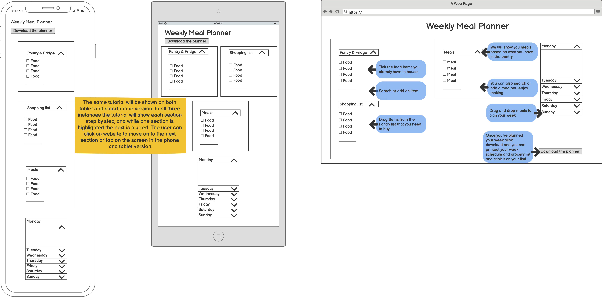
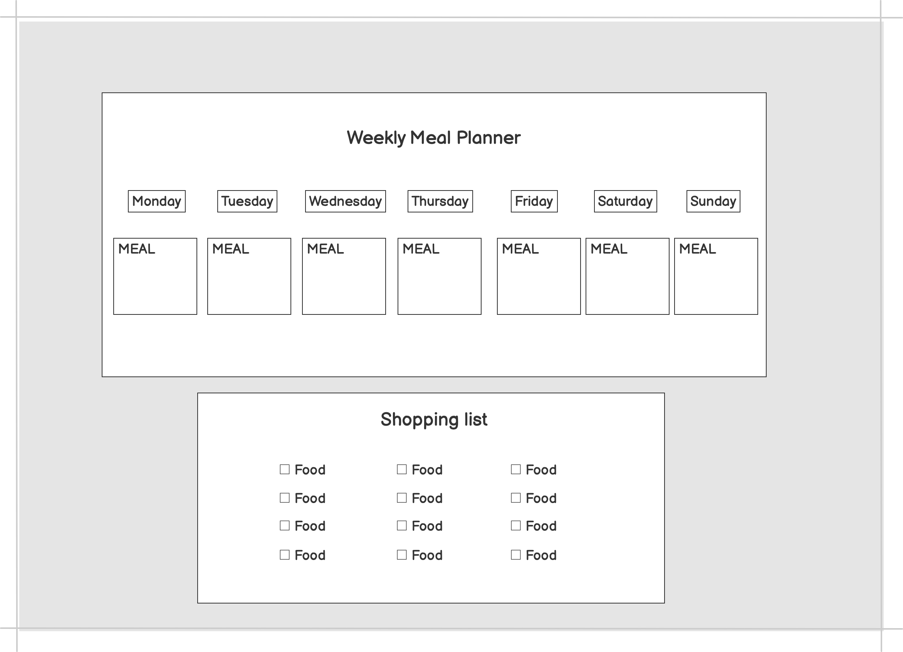

# Meal Planner

The aim of this assignment is to create a meal planner using Html, CSS and Javascript. The meal planner is a tool for anyone who cooks whether it's just for themselves or for their family or friends. The main idea is that on this page, a user can see all the groceries they have, any groceries they need to buy, meals they can make and add them to a weekly schedule.

## <ins> Contents </ins>
1. UX
    * Project Goals
    * User Goals
    * Developer Goals
    * User Stories
    * Design Choices
    * Wireframes
      
2. Features
3. Technologies used
4. Testing
5. Deployment
6. Credits

## 1. UX

### Project Goals

The aim of this project is for the user to have a one page site, where they can access all the information they need to plan their meals for the week. The user can pick what dietary options to see. They can tick from the list what groceries they already have. They can also add an item that is not on the list. 

### User Goals

The target audience for this page is anyone who cooks whether it's just for themselves, for their family or roommates. The goals are as follows:

- To be able to tick the groceries the customer already owns.
- To be able to add items that are not on the list.
- To be able to add groceries to the shopping list.
- To be able to see meal ideas based on the groceries they own.
- To be able to assign meals to a weekly calendar.

### Developer Goals

- As a student developer the main goal is always to create a site that functions and is responsive using the tools I'm learning during the course.
- I also want to create a fun and dynamic page where the users can organise and plan their meals.

### User Stories

As a user I want:

- to be able to see the list of food and tick the items I own.
- to be able to add items that I don't see on the list.
- to be able to add items to a shopping list so I know what I need.
- to be able to see meal ideas that match the groceries I own.
- to be able to add my meals to the list.
- to be able to move ingredients from the shopping list to the owned items list and vice versa.
- to be able to assign meals to a date in the week so I can plan my week.
- to be able to print the finalised version of the weekly planner as well as the shopping list.

### Design Choices

 ### Wireframes

 

 - The user will be welcomed with a beautiful full size image and the words Welcome on screen. By clicking the arrow at the bottom or scrolling down they will move on to the next step.

 

 - In this step the user chooses their preferred dietary option so the planner is customised for them. Once chosen the page will take them to the main page were a tutorial will show them how to use the website.

 

 - The tutorial will highlight each section and explain to the user step by step how to use the planner. Returning users will have an option to skip the tutorial. 
  
 

 - In the mobile and tablet version the customer will be able to move an item from one section to the other by pressing on the right of the food and then pick where they want to add it. They can do the same with the meals and choose which date they pick.

 - In the desktop version the user will be able to drag and drop their selections.

 

 - Finally, when the user is satisfied with their weekly plan they can download a pdf of the weekly plan and the shopping list which they can print and keep on their fridge!