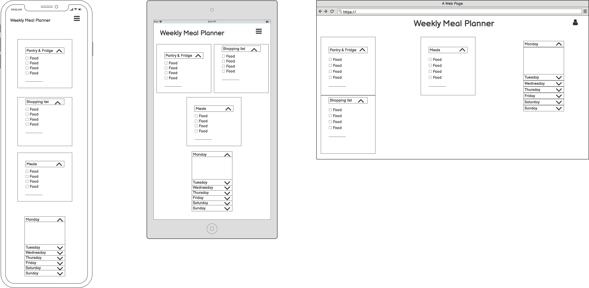

# Meal Planner

The aim of this assignment is to create a meal planner using Html, CSS and Javascript. The meal planner is a tool for anyone who cooks whether it's just for themselves or for their family or friends. The main idea is that on this page, a user can see all the groceries they have, any groceries they need to buy, meals they can make and add them to a weekly schedule.

## <ins> Contents </ins>
1. UX
    * Project Goals
    * User Goals
    * Developer Goals
    * User Stories
    * Design Choices
    * Wireframes
      
2. Features
3. Technologies used
4. Testing
5. Deployment
6. Credits

## 1. UX

### Project Goals

The aim of this project is for the user to have a one page site, where they can access all the information they need to plan their meals for the week. Within one page, the user can add the groceries they have, the groceries they need, the meals they're cooking and when they're cooking them.

### User Goals

The target audience for this page is anyone who cooks whether it's just for themselves, for their family or roommates. The goals are as follows:

- To be able to add the groceries the customer already owns.
- To be able to add groceries to the shopping list.
- To be able to list meal ideas based on what they have.
- To be able to assign meals to a weekly calendar.

### Developer Goals

- As a new developer student the main goal is always to create a site that functions and is responsive using the tools I'm learning during the course.
- I also want to create a fun and dynamic page where the users can organise their meails.

### User Stories

As a user I want:

- to be able to list all the grocery items I already have at home so I don't forget about certain things.
- to be able to add items to a shopping list so I know what I need.
- to be able to list meal ideas based off of the groceries I own.
- to be able to move the list items and attach them to meal ideas so I know where I'm using my groceries.
- to be able to move ingredients from the shopping list to the owned items list and vice versa.
- to be able to assign meals to a date in the week so I can plan my week.

### Design Choices

 ### Wireframes

 