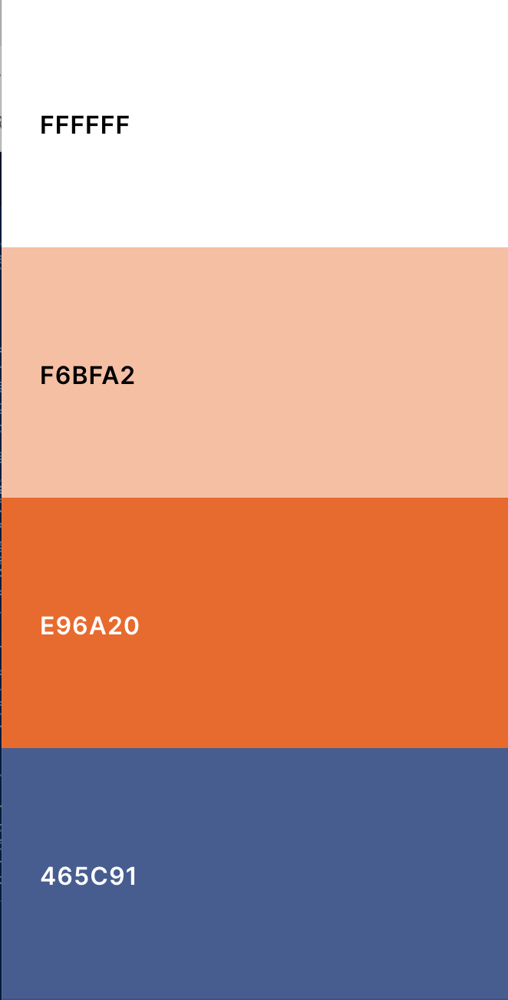
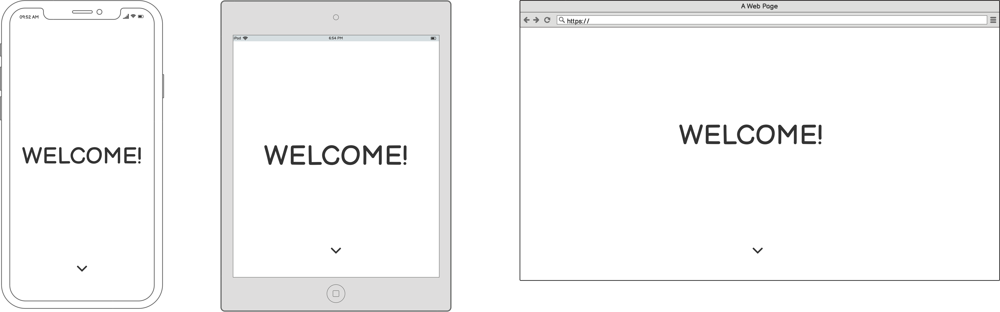
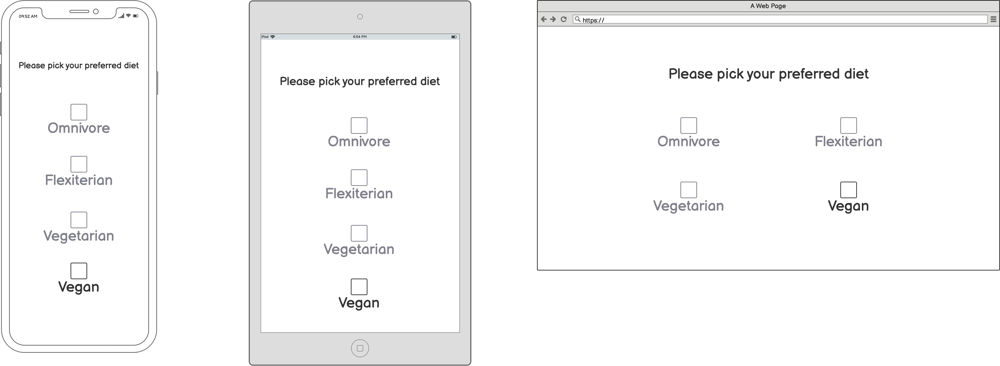
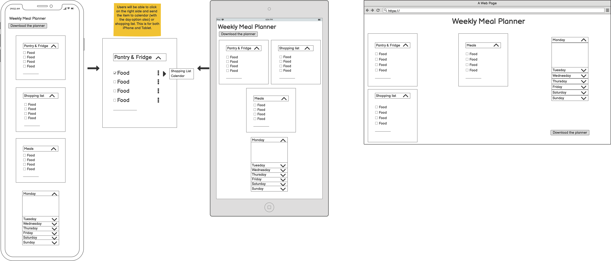

# Meal Planner

The aim of this assignment is to create a meal planner using Html, CSS and Javascript. The meal planner is a tool for anyone who cooks whether it's just for themselves or for their family or friends. The main idea is that on this page, a user can see all the groceries they have, any groceries they need to buy, meals they can make and add them to a weekly schedule.

## <ins> Contents </ins>
1. UX
    * Project Goals
    * User Goals
    * Developer Goals
    * User Stories
    * Design Choices
    * Wireframes
      
2. Features
3. Technologies used
4. Testing
5. Deployment
6. Credits

## 1. UX

### Project Goals

The aim of this project is for the user to have a one page site, where they can access all the information they need to plan their meals for the week. The user can pick what dietary options to see. They can tick from the list what groceries they already have. They can also add an item that is not on the list. 

### User Goals

The target audience for this page is anyone who cooks whether it's just for themselves, for their family or roommates. The goals are as follows:

- To be able to tick the groceries the customer already owns.
- To be able to drag and drop ingredients from the groceries list to the shopping list.
- To be able to see and add meal ideas.
- To be able to assign meals to a weekly calendar.

### Developer Goals

- As a student developer the main goal is always to create a site that functions and is responsive using the tools I'm learning during the course.
- I also want to create a fun and dynamic page where the users can organise and plan their meals.

### User Stories

As a user I want:

- to be able to filter between different dietary options.
- to be able to see the list of food and tick the items I own.
-- to be able to move ingredients from the shopping list to the owned items list and vice versa.
- to be able to see meal ideas and add my own meals to the list.
- to be able to assign meals to a date in the week so I can plan my week.

### Design Choices

* Colour Scheme

The inspiration behind this photo were the background photos themselves. Seeing the beatiful contrast of dark blue with orange made me realise how well those colours go together. The aim is contrast. I want to have a website that's easily readable but still nice to look at.

* Images

The images were sourced with from unsplash.com. 

### Wireframes

 

 

 
 

The initial plan was to have 3 seperate sections however whne building the website, I decided to make it more streamline and have it in 2 sections instead.

## 2. Features

The website is a one page website split into two sections.

* Welcome Page

This section greets the user to the page. There is an arrow at the bottom of the page that takes them to the second page.

* Main Page

This section has a dropdown menu for users to show their dietary preferences.

Once those are picked, a pantry and meal list is collatted. The user is able to drag items from the pantry to the shopping list. 
The user is also able to add new items to the meal list, and those will be joined in a dropdown in the calendar section.

* Features to implement in the future

The main feature that I would like to implement is an api that pulls recipes from other websites and have them connected with the groceries the user owns.

## 3. Technologies used

* Languages
    
    * HTML5
    * CSS3 
    * Javascript

* Frameworks and libraries

    * Bootstrap4
    * Jquery
    * Jquery UI
    * Font Awesome icons
    * Google fonts

* Workspace and version control

    * Github
    * Gitpod

* Wireframes

    * Balsamiq

## 4. [Testing](./TESTING.md)

## 5. Deployment

To deploy the Github pages, I did the following steps:

 * I used the Code Institute [template](https://github.com/Code-Institute-Org/gitpod-full-template) as a base for my project.
 * To do that I clicked on the new repository button.
 * Chose the Code Institute as a template.
 * Named it meal-planner.
 * Under the repository name, I clicked settings.
 * Then in settings I went to the Pages and changed the none drop down menu to master.
 * I then clicked save and the website was deployed.

 To run my code locally you need to EITHER :
* Go to the main page of the repository.
* Above the list there is a button with a downward arrow and code on it.

Then you  either :

* You can then chose between https, ssh key or github cli, and for all you click the little copy icon.
* Then you can open the terminal, type git clone and paste the url you copied and press enter.

or:

* click on open with Github Desktop and click choose.
* Find the local path you want to clone to and click clone.

## 6. Credits
 
### Content

* Images have been sourced from Unsplash.com

* Font used is Gothic A1 from google fonts.

* Fontawesome.com for the icons.

* Coolors.co and the images from Unsplash.com were used to pick a colour scheme.

### Code

* General

    * [Bootstrap](https://getbootstrap.com)
    * [W3Schools](https://www.w3schools.com) 
    * [CSS tricks](https://css-tricks.com)
    * [Stack Overflow](https://stackoverflow.com/)

* Specific Code

* [Stack Overflow for Touch Punch](https://stackoverflow.com/questions/4488601/jquery-draggable-images-on-ipad-iphone-how-to-integrate-event-preventdefau/4488662#4488662)

* [Table using bootstrap](https://getbootstrap.com/docs/4.0/content/tables/)

* [Adding new item to Meal List](https://freshman.tech/todo-list/*/)

* [Creating lists with javascript](http://jsfiddle.net/JWPZh/2/)

* [Sortable with the help of my mentor and Jquery UI](https://jqueryui.com/sortable/)

* [Droppable with the help of my mentor and Jquery UI](https://jqueryui.com/droppable/)

### Acknowledgements

Special thanks to my mentor Narender Singh with his help both with code and with calming me down when I'm stressed with an assignment.