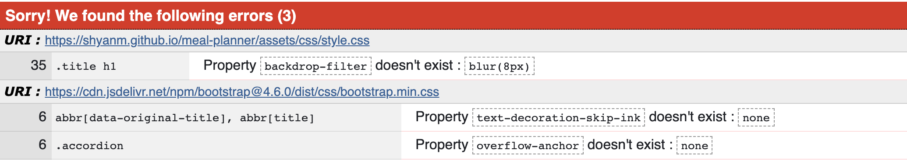
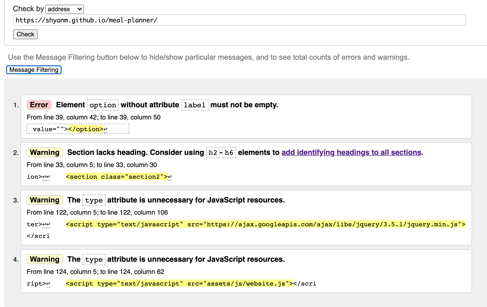

# Testing

[Main Readme.md](./README.md)

## User Stories

- to be able to filter between different dietary options.

    1. When a customer arrives on the landing page they see a welcome message and an arrow pointing downwards.
    2. When they click the arrow it will take them to the second section.
    3. There they will find a dropdown at the top of the section with 3 options. 
    4. Each option has an amount of food attached to it.
- to be able to see the list of food and tick the items I own.

    1. When each option provide a list of pantry items and meal ideas that fit the dietary requirement.
    2. In the pantry section users can scroll through and tick the items they have.
- to be able to move ingredients from the shopping list to the owned items list and vice versa.
    1. Users are able to drag and drop items from the pantry to the shopping list.
    2. They are then able to tick the items and drag them back to the pantry list.
- to be able to see meal ideas and add my own meals to the list.
    1. As mentioned before, customers are able to see meal ideas based on their dietary preference.
    2. Customers are able to add their own meals as well.

- to be able to assign meals to a date in the week so I can plan my week.

    1. In the calendar section, users can use a drop down menu to assign a meal to a day of the week.

    ## Validation testing

    ### [W3C CSS Validation Service](https://jigsaw.w3.org/css-validator/)

    

    The CSS showed an issue with the backdrop filter, so I changed it to a normal background colour so there won't be issues across platforms.

    